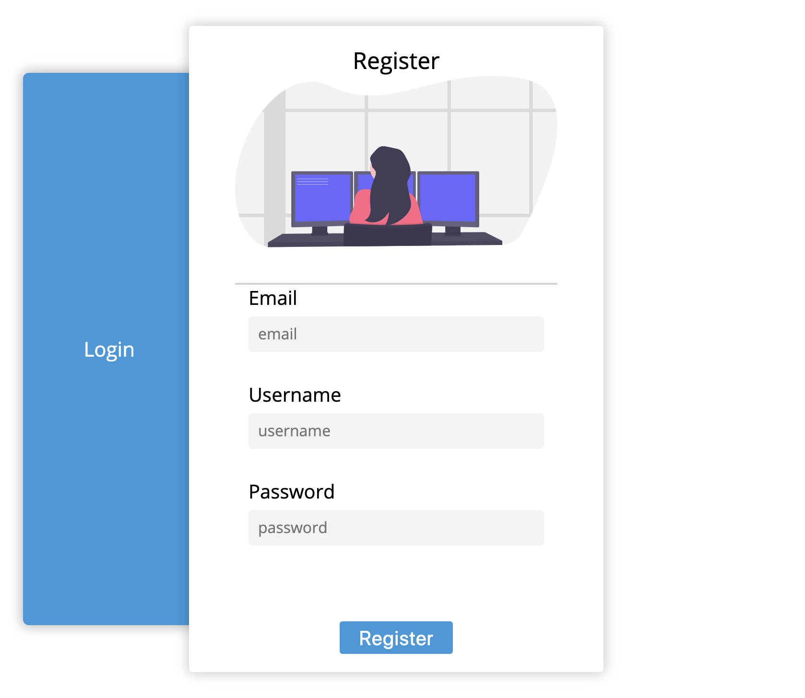
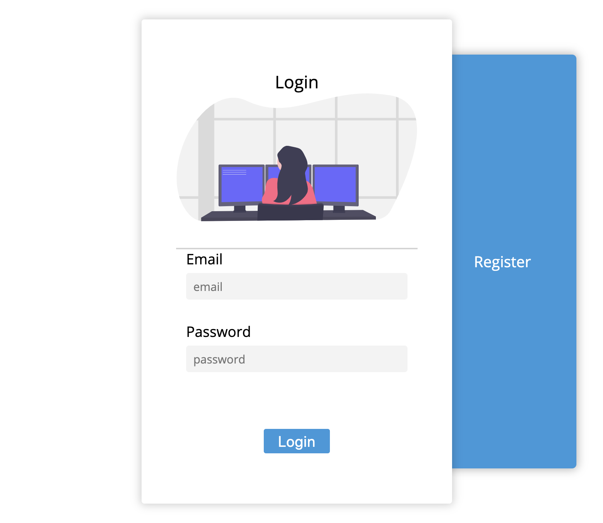
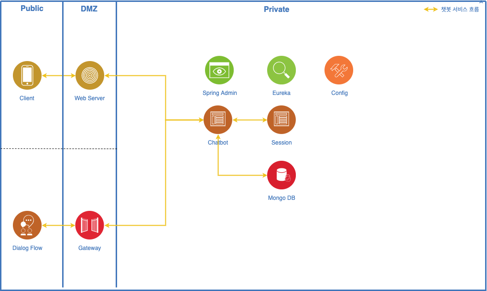

# Deltour

### :pineapple: Introduce My project
- Deltour is a chatbot to my second(Mark-2) project.  
- Mark-2 can dialog with user about travel and catch what you want travel style.
Finally Mark-1 will reccomand you travel area.

- It's my second chatbot project. It is compare The Iron Man's second model.

 | Regist | Login |
 |:---:|:---:|
 | | |

\
\
[]()
### :bust_in_silhouette: Development in progress
If you have any suggestions, do not hesitate contact me. => yuns994@gmail.com
\
[]()

| Chat-1 | Chat-2 |
|:---:|:---:|
|  |  |

---
\
\
[]()
## :hammer_and_wrench: Using Technology
1. Dialogflow (Google NLP model)
2. Spring Boot (chatbot server, security)
3. MySQL(to manage member), MongoDB(to use chatbot dialog)
4. AWS (EC2, RDS, S3)
5. (Eureka) // if i have a chance
6. (Elastic Search)

\
[]()

---
\
\
[]()
## :kaaba: Architecture Style
> HA (High availability)


* This Server have 3 container. such as Admin server, Cahtbot serer and Euraka server (Each container is running in WAS).

* To start with, When you request data using API, your request vIsit Web Server and detect intent your query in Dialog Flow.

* Finally, Chatbot server find suitable fulfillmentText in MongoDB. and return Json Object.

\
[]()

---
\
\
[]()
## :desktop_computer: Design Pattern
> Singleton Pattern
* In software engineering, the singleton pattern is a software design pattern that restricts the instantiation of a class to one "singIe" instance. This is useful when exactly one object is needed to coordinate actions across the system. The term comes from the mathematical concept of a singleton.


\
[]()

---
\
\
[]()
## :bulb: Usage Dependency

```gragle
dependencies {
    compile 'com.google.cloud:google-cloud-dialogflow:0.93.0-alpha'
    implementation 'org.springframework.boot:spring-boot-starter-data-mongodb'
    implementation 'org.springframework.boot:spring-boot-starter-data-rest'
}
```
> It used dialogflow as an NLP model only for analyzing intents.
> And other business logic and data used spring and NoSQL.

\
[]()
```gragle
dependencies {
    implementation 'org.springframework.boot:spring-boot-starter-security'
    implementation 'org.thymeleaf.extras:thymeleaf-extras-springsecurity5'
    compile group: 'com.auth0', name: 'java-jwt', version: '3.3.0'
  }
```
> It have login function using spring security. So permissions can be distinguished according to the user. When you success to this login function, I will send you JWT(Json web token).

\
\
[]()
---

\
[]()
## 📚 API Docs
### :page_facing_up: Detect Intent
> Context-type : application

| Method |  URI  | Description |
--------|--------|--------
| POST  | /api/detectIntent | Response of chatbot|

**Request**
```json
{
  "queryTxt": "Your saying."
}
```
**Response**
> Success : Response success
```json
{
    "code": 200,
    "success": true,
    "message": "Response success",
    "data": {
        "fulfillmentText": "Fulfillment Text",
        "img": "Image URI",
        "subFulfillmentText": "Sub Fulfillment Text",
    }
}
```

\
[]()
### :page_facing_up: Redirect
> Context-type : application

| Method |  URI  | Description |
--------|--------|--------
| POST  | /api/redirect | Redirect of your query text |

**Request**
```json
{
  "queryTxt": "Your saying."
}
```
**Response**
> Success : Response success
```json
{
    "code": 200,
    "success": true,
    "message": "success redirection",
    "data": {
        "fulfillmentText": "Fulfillment Text",
    }
}
```

\
[]()

---
\
\
[]()
### :page_facing_up: Sign Up
> Context-type : application

| Method |  URI  | Description |
--------|--------|--------
| POST  | /auth/signUp | Sign Up |

**Request**
```json
{
  "email": "yuns994@gmail.com",
  "usernae": "ooeuz",
  "password": "123123",
}
```
**Response**
> Success : Response success
```json
{
    "code": 200,
    "success": true,
    "message": "Sign Up",
    "data": {
        "email": "yuns994@gmail.com",
    }
}
```

\
[]()
### :page_facing_up: Form Login
> Context-type : application

| Method |  URI  | Description |
--------|--------|--------
| POST  | /auth/formLogin | Form Login function |

**Request**
```json
{
  "email": "yuns994@gmail.com",
  "password": "123123",
}
```
**Response**
> Success : Response success
```json
{
    "code": 200,
    "success": true,
    "message": "Form login success",
    "data": {
        "token": "JWT string",
    }
}
```

\
[]()

---
\
\
[]()
## :paperclip: Link
* [Front-end Link](https://github.com/ooeunz/deltour-ui)